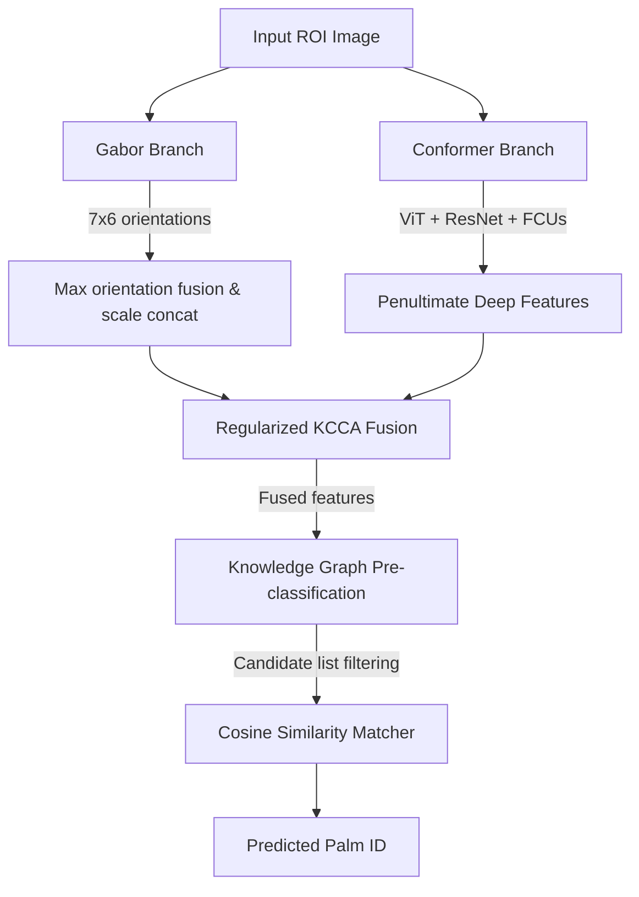

# PFFR Architecture & Module Specifications

This document outlines the software design, module boundaries, and execution logic of the **Palmprint Features Fusion Recognition** (PFFR) system.

---

## 1. System Architecture

The pipeline consists of the following components:

---

## 2. Module Specifications

### `palmrec/datasets`
Handles metadata CSV building, metadata normalization, and deterministic split generation (1:1 split, dropping odd samples per palm class).

### `palmrec/preprocessing`
Responsible for grayscaling/resizing images to $224 \times 224$ for the Gabor branch, and resizing/channel transposing/standard normalizations for the Conformer branch.

### `palmrec/features`
Extracted feature vector managers:
- Gabor filter bank convolution and orientations maximum pooling.
- normalizers caching feature vectors to `.npz`.

### `palmrec/models`
Visual Conformer PyTorch architecture implementation, coupling ResNet convolutional streams with ViT attention streams through Feature Coupling Units (FCUs).

### `palmrec/fusion`
Regularized Kernel CCA fitting and transformation, centering kernel matrices and projecting high-dimensional descriptors to canonical spaces.

### `palmrec/matching`
Knowledge Graph structural partitions, implementing two-stage candidate search and Cosine similarity threshold matching.
